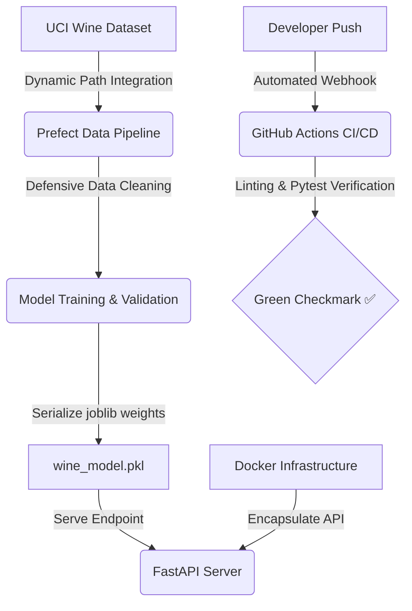

# End-to-End MLOps Wine Quality Pipeline

A production-ready, automated MLOps architecture designed to orchestrate data ingestion, model training, and model serving for the **UCI Wine Quality Dataset**. 

---

## 📐 Pipeline Architecture



---

## 🏗️ Core Engineering Features
* **Pipeline Orchestration:** Built with **Prefect** to manage data pipelines, task dependencies, and execution states.
* **Reproducible Data Ingestion:** Uses dynamic file paths for cross-platform compatibility, alongside automated, regex-driven schema sanitization.
* **Production API Serving:** Implements a high-performance **FastAPI** application with request validation enforced by **Pydantic**.
* **CI/CD Automation:** Configured with **GitHub Actions** to handle runner caching, deployment verification, code linting, and continuous integration testing via `pytest`.
* **Containerization:** Packaged inside an optimized, lightweight **Docker** container using `python:3.11-slim` images for zero-configuration deployment.

---

## 🚀 Local Installation & Execution

### Prerequisites
* **Miniconda / Anaconda** Installed
* **Docker Desktop** Running

### 1. Set Up Local Environment
```bash
# Create and activate your python core environment
conda create -n mlops_env python=3.11 -y
conda activate mlops_env

# Install your explicit production dependencies
pip install -r model_api/requirements.txt prefect pandas scikit-learn
```

### 2. Execute the Data Pipeline
```bash
# Start local orchestration engine dashboard
prefect server start
```
*Open a **new terminal tab or window**, activate your environment again, and run the pipeline script:*
```bash
# Activate env and execute training pipeline script
conda activate mlops_env
python data_pipeline/pipeline.py
```

---

### 3. Build & Run the Container Layout
```bash
# Navigate to the API microservice folder
cd model_api

# Build the isolated container image
docker build -t wine-quality-api .

# Run the live microservice
docker run -p 8000:8000 wine-quality-api
```

---

### 4. Verify Predictions with Client Scripts
*While the Docker container is active in primary terminal window, open a **new terminal window or Anaconda/Jupyter Prompt** to hit the API using the included testing client:*

```bash
# Navigate to the API folder and activate your environment
cd model_api
conda activate mlops_env

# Trigger the client script using the local payload file
python predict.py
```
*(For Linux/macOS environments, alternatively initialize via the automation shell script: `./predict.sh`)*

---

## 🔮 Sample API Request Payloads

When the container or local server is active, the FastAPI endpoint listens for POST requests at `http://localhost:8000/predict`.

### Request Layout (POST /predict)
```json
{
  "fixed_acidity": 7.4,
  "volatile_acidity": 0.70,
  "citric_acid": 0.00,
  "residual_sugar": 1.9,
  "chlorides": 0.076,
  "free_sulfur_dioxide": 11.0,
  "total_sulfur_dioxide": 34.0,
  "density": 0.9978,
  "pH": 3.51,
  "sulphates": 0.56,
  "alcohol": 9.4
}
```

### Response Layout
```json
{
  "predicted_quality": 5.1155
}
```

---

## 📂 Project Structure

```text
## 📂 Project Structure

```text
local-mlops-pipeline/
├── .github/
│   └── workflows/
│       └── test.yml          # GitHub Actions CI/CD pipeline
├── data/
│   └── winequality-red.csv   # UCI Red Wine Dataset
├── data_pipeline/
│   └── pipeline.py           # Prefect pipeline (Data ingestion & training)
└── model_api/
    ├── app.py                # FastAPI Application
    ├── test_app.py           # Pytest integration suite
    ├── predict.py            # Local Python request client
    ├── predict.sh            # Automation Shell script to trigger client
    ├── sample_payload.json   # Mock JSON data structure matching schema
    ├── Dockerfile            # Optimized python:3.11-slim container config
    ├── requirements.txt      # Explicitly pinned production dependencies
    └── wine_model.pkl        # Serialized model artifact

```
